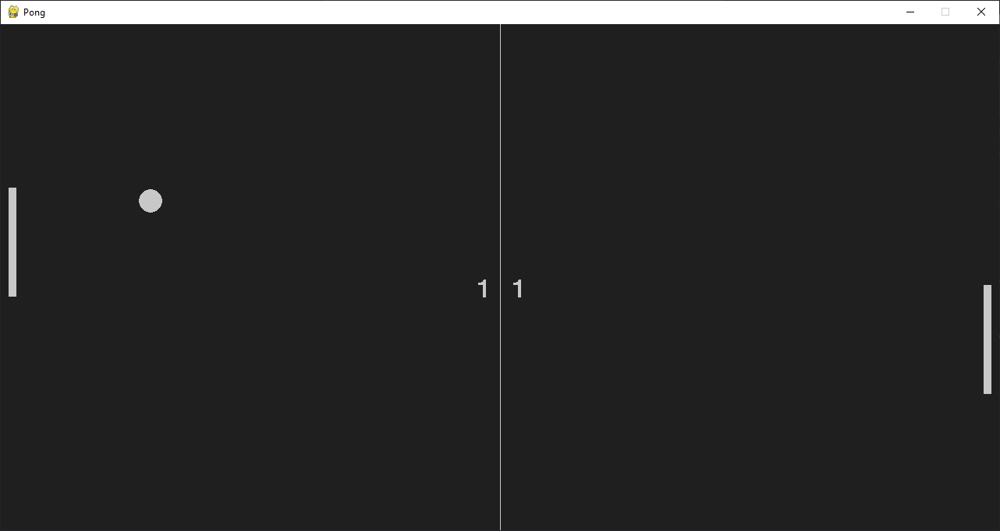

# Pong

The classic pong game made in python with pygame. it has a computer player so 1 person can play against the computer.

# Download

To play the game. either download the source code from the github release and run the `main.py` file or just download the `game.exe` file and run it. You can control your paddle with the arrow keys.

